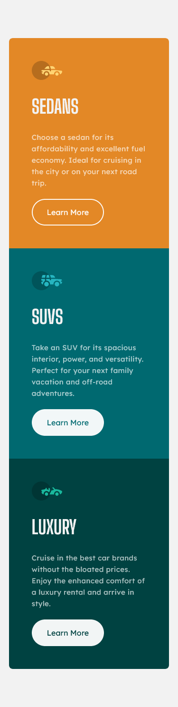
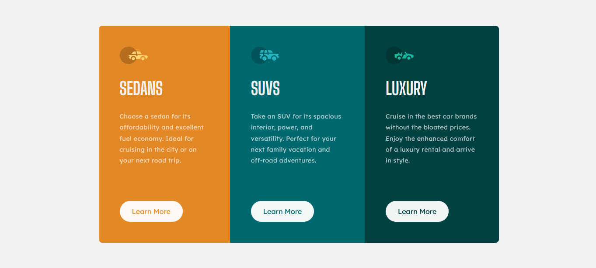

<h1 align="center">
  🚘  <a href="#">3-column preview card</a>
</h1>

<h3 align="center"> 
  👀 Challenge Frontend Mentor
</h3>

  

  

  

  
    
  

<h4 align="center"> 
	🚧 Status: Finished 🚀
</h4>

 <a href="#-about">About</a> •
 <a href="#-layout">Layout</a> • 
 <a href="#-tech-stack">Tech Stack</a> • 
 <a href="#-author">Author</a> • 
 <a href="#-license">License</a>

## 📃 About

-   A simple project to do but a lot of fun, thanks to the challenge I met proposed I got to know the **[mix-blend-mode property](https://developer.mozilla.org/en-US/docs/Web/CSS/mix-blend-mode)**, which helped me to blend the text color with the background color

---

## 🎨 Layout

### 📱 Mobile

  

  

### 💻 Web

  

  

---

## 🛠 Tech Stack

The following tools were used in the construction of the project:

-   HTML 
-   SASS 
-   Font Family:  **[Lexend Deca](https://fonts.google.com/specimen/Lexend+Deca)**,  **[Big Shoulders Display](https://fonts.google.com/specimen/Big+Shoulders+Displayhttps://fonts.google.com/specimen/Big+Shoulders+Display)**
---

## 😎 Author

<b>Thiago Moreira</b>

Made with ❤️ by Thiago Moreira 👋🏽 Get in touch!

---

## ⚖ License

This project is under the license [MIT](./LICENSE)
